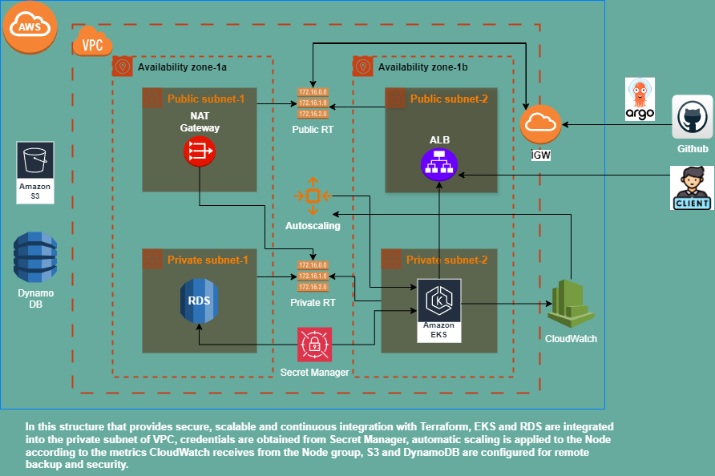

# Microservice-EKS-RDS-Argocd



This project consists of a microservise Phonebook application written in Python and developed using the Flask framework, setting up a VPC on AWS with Terraform, creating an RDS and EKS cluster in a private subnet, configuring the GitOps workflow using ArgoCD and Ingress Controller, and deploying the application on EKS using credentials information from AWS Secrets Manager.

## Requirements
1. **AWS CLI** - used to manage AWS services. Version: aws-cli/2.18.4
2. **Terraform** - Tool for managing infrastructure with code. Version: v1.9.7
3. **kubectl** - Command line tool for managing Kubernetes cluster. Version: v1.31.0
4. **Git** - for integration with GitHub. Version: 2.34.1

# Step 1:
> > > We create a new user in AWS with access rights to VPC, EKS, RDS, Secret Manager, S3, DaynamoDb, CloudWatch, Ec2 services.

> > > With the Secret Key and Secret Access Key information of this user we created, we access AWS services via CLI by doing sh`aws configure` from our local computer.

# Step 2:
> > > We add AWS SDK boto3 to the Phonebook application written in Python and developed using Flask framework to enable the application to pull the credentials required for the database from AWS Secret manager. There is an added version in the repo.

# Step 3:
>>> In AWS Secret manager, we create a secret with the same name as **“prod/mysql/credentials ‘** specified in line 13 in the application code and enter the credentials required for RDS in the form of ’key”, “value”.

# Step 4:
> > > We write the Dockerfile to containerize the application.

```sh
# Dockerfile for web server
FROM python:alpine
COPY requirements.txt requirements.txt
RUN pip install -r requirements.txt
WORKDIR /app
COPY . /app
EXPOSE 80
CMD python ./app.py
```

```sh
# Dockerfile for result server
FROM python:alpine
COPY requirements.txt requirements.txt
RUN pip install -r requirements.txt
WORKDIR /app
COPY . /app
EXPOSE 80
CMD python ./app.py
```

```sh
# requirements.txt
flask==2.3.3
PyMySQL==1.0.2
boto3
```

# Step 5:
> > > > We build image with Dockerfile and push it to Dockerhub.

```sh
docker build -t mecit35/web-server .
```

```sh
docker build -t mecit35/result-server-2 .
```

```sh
docker login
```

```sh
docker push mecit35/web-server
```

```sh
docker push mecit35/result-server-2
```

# Step 6:
> > > > We prepare the k8s manifest files of the application.

Deployment and Service yaml files for web-server:

```sh
apiVersion: apps/v1
kind: Deployment
metadata:
  name: web-deploy
spec:
  replicas: 1
  selector:
    matchLabels:
      name: web-pod
  template:
    metadata:
      labels:
        name: web-pod
    spec:
      containers:
        - image: mecit35/web-server
          name: web-pod
          ports:
            - containerPort: 80
          imagePullPolicy: Always

          resources:
            requests:
              cpu: "100m"
              memory: "128Mi"
            limits:
              cpu: "500m"
              memory: "512Mi"

---
apiVersion: v1
kind: Service
metadata:
  name: web-service
  labels:
    name: web-svc
spec:
  selector:
    name: web-pod
  type: NodePort
  ports:
    - port: 80
      targetPort: 80
      nodePort: 30001
```

Deployment and Service yaml files for Result-server:

```sh
apiVersion: apps/v1
kind: Deployment
metadata:
  name: result-deployment
spec:
  replicas: 1
  selector:
    matchLabels:
      name: result
  template:
    metadata:
      labels:
        name: result
    spec:
      containers:
        - image: mecit35/result-server-2
          name: result
          ports:
            - containerPort: 80
          imagePullPolicy: Always

          resources:
            requests:
              cpu: "100m"
              memory: "128Mi"
            limits:
              cpu: "500m"
              memory: "512Mi"
---
apiVersion: v1
kind: Service
metadata:
  name: result-service
  labels:
    name: result-service
spec:
  selector:
    name: result
  type: NodePort
  ports:
    - port: 80
      targetPort: 80
      nodePort: 30002
```

Pv and pvc yaml files for storage space:

```sh
apiVersion: v1
kind: PersistentVolume
metadata:
  name: my-pv
  labels:
    type: local
spec:
  storageClassName: manual
  capacity:
    storage: 5Gi
  accessModes:
    - ReadWriteOnce
  hostPath:
    path: "/home/ubuntu/myvolume"
---
apiVersion: v1
kind: PersistentVolumeClaim
metadata:
  name: my-pvc
spec:
  storageClassName: manual
  accessModes:
    - ReadWriteOnce
  resources:
    requests:
      storage: 4Gi
```

Horizontal Pod Autoscaler yaml files to scale the pods:

for web server:

```sh
apiVersion: autoscaling/v2
kind: HorizontalPodAutoscaler
metadata:
  name: web-deploy-hpa
  namespace: default
spec:
  scaleTargetRef:
    apiVersion: apps/v1
    kind: Deployment
    name: web-deploy
  minReplicas: 1
  maxReplicas: 10
  metrics:
    - type: Resource
      resource:
        name: cpu
        target:
          type: Utilization
          averageUtilization: 50
```

for result server:

```sh
apiVersion: autoscaling/v2
kind: HorizontalPodAutoscaler
metadata:
  name: result-service-hpa
  namespace: default
spec:
  scaleTargetRef:
    apiVersion: apps/v1
    kind: Deployment
    name: result-deployment
  minReplicas: 1
  maxReplicas: 10
  metrics:
    - type: Resource
      resource:
        name: cpu
        target:
          type: Utilization
          averageUtilization: 50
```

> > > In order to deploy these deploy resources with ArgoCd, we need to push them to a github repo.

> > > Our application is ready. To check if the application is working, we can try to stand up a t2.micro instance in the EC2 console, install docker and give EC2 access to the Secret manager that will be required.

# Step 7:
> > > > We use S3 to securely store, version, and encrypt Terraform's state files, and also use DynamoDB table for locking to avoid multi-processing issues. We add privacy, security, and reversibility features.

```sh
# backend-setup.tf

provider "aws" {
  region = "us-east-1"
}

# S3 Bucket Creation
resource "aws_s3_bucket" "terraform_state" {
  bucket = "mecit-terraform-state" # Choose a unique bucket name
  force_destroy = true  # to delete this bucked when we say terraform destroy. ATTENTION!!!

  tags = {
    Name        = "Terraform State Bucket"
    Environment = "Production"
  }
 }

# S3 Bucket Public Access Block Setting
resource "aws_s3_bucket_public_access_block" "terraform_state_block" {
  bucket = aws_s3_bucket.terraform_state.id

  block_public_acls       = true
  block_public_policy     = true
  ignore_public_acls      = true
  restrict_public_buckets = true
}


# S3 Bucket Versioning Setting
resource "aws_s3_bucket_versioning" "terraform_state_versioning" {
  bucket = aws_s3_bucket.terraform_state.id

  versioning_configuration {
    status = "Enabled"
  }
}

#S3 Bucket Server-Side Encryption Setting
resource "aws_s3_bucket_server_side_encryption_configuration" "terraform_state_encryption" {
  bucket = aws_s3_bucket.terraform_state.id

  rule {
    apply_server_side_encryption_by_default {
      sse_algorithm = "AES256"
    }
  }
}

# DynamoDB Table Creation (for State Locking)
resource "aws_dynamodb_table" "terraform_locks" {
  name         = "mecit-terraform-state-lock"
  billing_mode = "PAY_PER_REQUEST"
  hash_key     = "LockID"

  attribute {
    name = "LockID"
    type = "S"
  }

  tags = {
    Name        = "Terraform State Lock Table"
    Environment = "Production"
  }
}
```


To implement terraforming;

````sh
terraform init #providers downloads
````
````sh
terraform plan #shows the resources that will be generated and any errors
````
````sh
terraform apply #code starts to apply, resources are created.
````
````sh
terraform destroy #To terminate resources.
````

# Step 8:
> > > > We create the Ingress yaml file of our application for the Nginx Ingress Controller that we will install in the EKS we will create. This file should be in the same directory as the tf file where we created the EKS and its name should be “App-Ingress.yaml” which will be specified in the tf file:

```sh
apiVersion: networking.k8s.io/v1
kind: Ingress
metadata:
  name: microservices-ingress
  namespace: default
  annotations:
    nginx.ingress.kubernetes.io/rewrite-target: /
spec:
  ingressClassName: nginx
  rules:
    - http:
        paths:
          - path: "/"
            pathType: Prefix
            backend:
              service:
                name: web-service
                port:
                  number: 80
          - path: "/result"
            pathType: Prefix
            backend:
              service:
                name: result-service
                port:
                  number: 80
```

> > > > We create the yaml file where we specify the GitOps workflow for ArgoCd that we will install in the EKS we will create. This file should be in the same directory as the tf file where we created the EKS and its name should be “App-Deploy-Argocd.yaml” which will be specified in the tf file:

```sh
apiVersion: argoproj.io/v1alpha1
kind: Application
metadata:
  name: microservice-eks-rds-argocd
  namespace: argocd  # Namespace where ArgoCD is installed
spec:
  project: default  # ArgoCD project (set by default)

  source:
    repoURL: "https://github.com/Mecit-tuksoy/Microservice-EKS-RDS-Argocd.git"  
    targetRevision: "main" 
    path: "deploy"  

  destination:
    server: "https://kubernetes.default.svc" 
    namespace: default  

  syncPolicy:
    automated: {} 
```

# Step 9:
> > > > Now we start creating our terraform file where we specify the resources that we will stand up in AWS. I will explain this file piece by piece:

```sh
terraform {
  backend "s3" {
    bucket         = "mecit-terraform-state"
    key            = "terraform/state/phonebookdb.tfstate"
    region         = "us-east-1"
    dynamodb_table = "mecit-terraform-state-lock"
    encrypt        = true
  }

  required_providers {
    aws = {
      source  = "hashicorp/aws"
      version = "~> 5.0"
    }
    kubernetes = {
      source  = "hashicorp/kubernetes"
      version = "~> 2.0"
    }
    helm = {
      source  = "hashicorp/helm"
      version = "~> 2.0"
    }
    null = {
      source  = "hashicorp/null"
      version = "~> 3.0"
    }
  }
}

provider "aws" {
  region = "us-east-1"
}
```

- In this configuration, it enables Terraform to securely store the remote state file in the bucked we created previously in S3 and provides locking using DynamoDB so that multiple Terraform processes cannot change the state file at the same time.

- AWS, Kubernetes, Helm and Null providers are defined and the necessary infrastructure management is realized. Versions are specified for each provider, thus ensuring compatibility between these versions.

```sh

# VPC Configuration
resource "aws_vpc" "eks_vpc" {
  cidr_block           = "172.20.0.0/16"
  enable_dns_support   = true
  enable_dns_hostnames = true
  tags = {
    Name = "eks-vpc"
  }
}

# Public Subnet
resource "aws_subnet" "public_eks_subnet" {
  count 	    = 2
  vpc_id            = aws_vpc.eks_vpc.id
  cidr_block        = element(["172.20.1.0/24", "172.20.2.0/24"], count.index)
  availability_zone = element(["us-east-1a", "us-east-1b"], count.index)
  map_public_ip_on_launch = true
  tags = {
    "Name" = "eks-public-subnet-${count.index}"
    "kubernetes.io/role/elb" = "1"
  }
  depends_on = [aws_vpc.eks_vpc]
}

variable "eks_cluster_name" {
  default = "my-eks-cluster"
}

# Private Subnet
resource "aws_subnet" "private_eks_subnet" {
  count             = 2
  vpc_id            = aws_vpc.eks_vpc.id
  cidr_block        = element(["172.20.3.0/24", "172.20.4.0/24"], count.index)
  availability_zone = element(["us-east-1a", "us-east-1b"], count.index)
  map_public_ip_on_launch = false
  tags = {
    "Name" = "eks-private-subnet-${count.index}"
    "kubernetes.io/cluster/${var.eks_cluster_name}" = "owned"
    "kubernetes.io/role/internal-elb" = "1"
  }
  depends_on = [
    aws_vpc.eks_vpc
  ]
}

# Internet Gateway
resource "aws_internet_gateway" "igw" {
  vpc_id = aws_vpc.eks_vpc.id
  tags = {
    Name = "my-eks-cluster-igw"
  }
  depends_on = [
    aws_vpc.eks_vpc
  ]
}

# Elastic IP for NAT Gateway
resource "aws_eip" "nat_eip" {
  domain = "vpc"
  tags = {
    Name = "eks-nat-eip"
  }
}

# NAT Gateway
resource "aws_nat_gateway" "nat_gw" {
  allocation_id = aws_eip.nat_eip.id
  subnet_id     = aws_subnet.public_eks_subnet[0].id
  tags = {
    Name = "eks-nat-gateway"
  }
  depends_on = [
    aws_eip.nat_eip,
    aws_subnet.public_eks_subnet,
    aws_vpc.eks_vpc
  ]
}

# Public Route Table
resource "aws_route_table" "public" {
  vpc_id = aws_vpc.eks_vpc.id
  route {
    cidr_block = "0.0.0.0/0"
    gateway_id = aws_internet_gateway.igw.id
  }
  tags = {
    Name = "eks-public-route-table"
  }
  depends_on = [
    aws_internet_gateway.igw,
    aws_vpc.eks_vpc
  ]
}

# Public Route Table Association
resource "aws_route_table_association" "public" {
  count          = 2
  subnet_id      = element(aws_subnet.public_eks_subnet[*].id, count.index)
  route_table_id = aws_route_table.public.id
  depends_on = [
    aws_internet_gateway.igw,
    aws_route_table.public,
    aws_subnet.public_eks_subnet,
    aws_vpc.eks_vpc
  ]
}

# Private Route Table
resource "aws_route_table" "private" {
  vpc_id = aws_vpc.eks_vpc.id
  route {
    cidr_block     = "0.0.0.0/0"
    nat_gateway_id = aws_nat_gateway.nat_gw.id
  }
  tags = {
    Name = "eks-private-route-table"
  }
  depends_on = [
    aws_eip.nat_eip,
    aws_nat_gateway.nat_gw,
    aws_subnet.public_eks_subnet,
    aws_vpc.eks_vpc
  ]
}

# Private Route Table Association
resource "aws_route_table_association" "private" {
  count = 2  
  subnet_id      = aws_subnet.private_eks_subnet[count.index].id
  route_table_id = aws_route_table.private.id
  depends_on = [
    aws_eip.nat_eip,
    aws_nat_gateway.nat_gw,
    aws_route_table.private,
    aws_subnet.private_eks_subnet,
    aws_subnet.public_eks_subnet,
    aws_vpc.eks_vpc
  ]
}
```

> > > > This configuration creates an appropriate VPC for EKS in AWS. Public subnets can access the internet directly, while private subnets access the internet via NAT Gateway. This is necessary to create a secure and scalable Kubernetes environment.

```sh
# Security Groups
resource "aws_security_group" "eks_cluster_sg" {
  name        = "my-eks-cluster-eks-cluster-sg"
  description = "EKS cluster security group"
  vpc_id      = aws_vpc.eks_vpc.id
  ingress {
    from_port       = 0
    to_port         = 0
    protocol        = "-1"
    self            = true
  }
  ingress {
    description = "Allow HTTPS traffic from anywhere"
    from_port   = 443
    to_port     = 443
    protocol    = "tcp"
    cidr_blocks = ["0.0.0.0/0"]
  }
  egress {
    from_port   = 0
    to_port     = 0
    protocol    = "-1"
    cidr_blocks = ["0.0.0.0/0"]
  }
  tags = {
    Name = "my-eks-cluster-eks-cluster-sg"
  }
  depends_on = [aws_vpc.eks_vpc]
}

resource "aws_security_group" "eks_node_sg" {
  name        = "my-eks-cluster-eks-node-sg"
  description = "EKS worker node security group"
  vpc_id      = aws_vpc.eks_vpc.id
  ingress {
    from_port       = 0
    to_port         = 0
    protocol        = "-1"
    security_groups = [aws_security_group.eks_cluster_sg.id]
  }
  ingress {
  from_port   = 443
  to_port     = 443
  protocol    = "tcp"
  security_groups = [aws_security_group.eks_cluster_sg.id]
}
  egress {
    from_port   = 0
    to_port     = 0
    protocol    = "-1"
    cidr_blocks = ["0.0.0.0/0"]
  }
  tags = {
    Name = "my-eks-cluster-eks-node-sg"
  }
  depends_on = [
    aws_vpc.eks_vpc,
    aws_security_group.eks_cluster_sg
  ]
}

resource "aws_security_group" "alb_sg" {
  name        = "alb-sg"
  description = "Security group for ALB"
  vpc_id      = aws_vpc.eks_vpc.id
  ingress {
    description = "Allow HTTPS traffic from anywhere"
    from_port   = 22
    to_port     = 22
    protocol    = "tcp"
    cidr_blocks = ["0.0.0.0/0"]
  }
  ingress {
    description = "Allow HTTP traffic from anywhere"
    from_port   = 80
    to_port     = 80
    protocol    = "tcp"
    cidr_blocks = ["0.0.0.0/0"]
  }
  ingress {
    description = "Allow HTTPS traffic from anywhere"
    from_port   = 443
    to_port     = 443
    protocol    = "tcp"
    cidr_blocks = ["0.0.0.0/0"]
  }
  egress {
    from_port   = 0
    to_port     = 0
    protocol    = "-1"
    cidr_blocks = ["0.0.0.0/0"]
  }
  tags = {
    Name = "alb-sg"
  }
  depends_on = [
    aws_vpc.eks_vpc
  ]
}

resource "aws_security_group" "ec2_sg" {
  name        = "rds-ec2-sg"
  description = "RDS EC2 security group"
  vpc_id      = aws_vpc.eks_vpc.id
  ingress {
    description = "Allow HTTPS traffic from anywhere"
    from_port   = 22
    to_port     = 22
    protocol    = "tcp"
    cidr_blocks = ["0.0.0.0/0"]
  }
  egress {
    from_port   = 0
    to_port     = 0
    protocol    = "-1"
    cidr_blocks = ["0.0.0.0/0"]
  }
  tags = {
    Name = "ec2-sg"
  }
  depends_on = [
    aws_vpc.eks_vpc
  ]
}

resource "aws_security_group" "rds_sg" {
  name        = "rds_security_group"
  description = "Allow MySQL access"
  vpc_id      = aws_vpc.eks_vpc.id
  ingress {
    from_port   = 3306
    to_port     = 3306
    protocol    = "tcp"
    security_groups = [
        aws_security_group.eks_cluster_sg.id,
        aws_security_group.eks_node_sg.id,
        aws_security_group.ec2_sg.id
        ]
  }
  egress {
    from_port   = 0
    to_port     = 0
    protocol    = "-1"
    cidr_blocks = ["0.0.0.0/0"]
  }
  tags = {
    Name = "rds_sg"
  }
  depends_on = [
    aws_vpc.eks_vpc,
    aws_security_group.eks_cluster_sg,
    aws_security_group.eks_node_sg
  ]
}
```

> > > > In this Terraform configuration, security groups are defined for different AWS components. The purpose of each security group is;

- To control all traffic to and from the EKS cluster.
- To ensure the communication of EKS worker nodes with the cluster.
- To manage HTTP, HTTPS and SSH traffic coming from Application Load Balancer (ALB).
- Providing SSH access to EC2 instances.
- Managing MySQL (3306) traffic from EKS and EC2 to RDS database.

```sh

resource "aws_db_subnet_group" "main" {
  name       = "main-db-subnet-group"
  subnet_ids = [
    for subnet in aws_subnet.private_eks_subnet : subnet.id  # We get the ID of each subnet
  ]
  tags = {
    Name = "main-db-subnet-group"
  }
  depends_on = [
    aws_vpc.eks_vpc,
    aws_subnet.private_eks_subnet
  ]
}

# RDS MySQL 5.7 Instance
resource "aws_db_instance" "mysql" {
  allocated_storage       = 20
  storage_type            = "gp3"
  engine                  = "mysql"
  engine_version          = "8.0.32"  #"5.7.44"
  instance_class          = "db.t3.micro"
  identifier              = "phonebookdb"
  username                = local.credentials.username
  password                = local.credentials.password
  parameter_group_name    = "default.mysql8.0" #"default.mysql5.7"
  db_subnet_group_name    = aws_db_subnet_group.main.id
  vpc_security_group_ids  = [aws_security_group.rds_sg.id]
  publicly_accessible     = false
  skip_final_snapshot     = true  # Final snapshot will not be created
  tags = {
    Name = "phonebookdb"
  }
  depends_on = [
    aws_vpc.eks_vpc,
    aws_subnet.private_eks_subnet,
    aws_db_subnet_group.main
  ]
}

# Data Sources to Pull Credentials Information from AWS Secrets Manager
data "aws_secretsmanager_secret_version" "credentials" {
  secret_id = "prod/mysql/credentials"
}

locals {
  credentials = jsondecode(data.aws_secretsmanager_secret_version.credentials.secret_string)
}

data "aws_ami" "latest_amazon_linux" {
  most_recent = true
  owners = ["137112412989"]
  filter {
    name   = "name"
    values = ["amzn2-ami-hvm-*-x86_64-gp2"]
  }
}

resource "aws_instance" "my_instance" {
  ami           = data.aws_ami.latest_amazon_linux.id
  instance_type = "t2.micro"
  subnet_id     = aws_subnet.public_eks_subnet[0].id
  security_groups = [aws_security_group.ec2_sg.id]
  tags = {
    Name = "MyEC2Instance"
  }
  key_name = "newkey"
  user_data = <<-EOF
              #!/bin/bash
              yum update -y
              yum install -y mysql
              EOF
  depends_on = [
    aws_security_group.ec2_sg,
    aws_db_instance.mysql]
}

# RDS veritabanını başlatma
resource "null_resource" "initialize_db" {
  depends_on = [
    aws_db_instance.mysql,
    aws_instance.my_instance
    ]
  provisioner "remote-exec" {
    inline = [
      "for i in {1..30}; do mysql -h ${aws_db_instance.mysql.address} -u ${local.credentials.username} -p${local.credentials.password} -e 'CREATE DATABASE IF NOT EXISTS phonebookdb;' && break || echo 'Waiting for database...' && sleep 10; done"
    ]
    connection {
      type        = "ssh"
      host        = aws_instance.my_instance.public_ip
      user        = "ec2-user"
      private_key = file("/home/mecit/.ssh/newkey.pem")
    }
  }
}

resource "null_resource" "cleanup" {
  depends_on = [null_resource.initialize_db]
  provisioner "local-exec" {
    command = "aws ec2 terminate-instances --instance-ids ${aws_instance.my_instance.id} --region us-east-1"
  }
}

# Secrets Manager Secret Version
resource "aws_secretsmanager_secret_version" "rds_endpoint_secret_version" {
  secret_id = "prod/mysql/endpoint"
  secret_string = <<EOF
{
  "host": "${aws_db_instance.mysql.address}"
}
EOF
  depends_on = [aws_db_instance.mysql]
}
```

> > > > With this Terraform configuration;

- RDS database is enabled to run only on private subnets.
- MySQL 8.0 database is created.
- Database credentials stored in AWS Secrets Manager are retrieved and used.
- An EC2 instance with MySQL client installed is created and a database named phonebookdb is created by connecting to the RDS database through the EC2 instance. Then the EC2 instance is automatically deleted after the process is completed.
- The RDS database endpoint information is stored in AWS Secrets Manager.

```sh

# IAM Roles and Attachments
resource "aws_iam_role" "eks_role" {
  name = "eks-role"
  assume_role_policy = jsonencode({
    Version = "2012-10-17"
    Statement = [
      {
        Action = "sts:AssumeRole"
        Effect = "Allow"
        Principal = {
          Service = "eks.amazonaws.com"
        }
      }
    ]
  })
}
resource "aws_iam_role_policy_attachment" "eks_policy" {
  role       = aws_iam_role.eks_role.name
  policy_arn = "arn:aws:iam::aws:policy/AmazonEKSClusterPolicy"
  depends_on = [
    aws_iam_role.eks_role
  ]
}
resource "aws_iam_role_policy_attachment" "CloudWatch_eks_policy" {
  role       = aws_iam_role.eks_role.name
  policy_arn = "arn:aws:iam::aws:policy/CloudWatchFullAccess"
  depends_on = [
    aws_iam_role.eks_role
  ]
}
resource "aws_iam_role_policy_attachment" "AutoScaling_eks_policy" {
  role       = aws_iam_role.eks_role.name
  policy_arn = "arn:aws:iam::aws:policy/AutoScalingFullAccess"
  depends_on = [
    aws_iam_role.eks_role
  ]
}
resource "aws_iam_role_policy_attachment" "Service_eks_policy" {
  role       = aws_iam_role.eks_role.name
  policy_arn = "arn:aws:iam::aws:policy/AmazonEKSServicePolicy"
  depends_on = [
    aws_iam_role.eks_role
  ]
}
resource "aws_iam_role_policy_attachment" "RDS_eks_policy" {
  role       = aws_iam_role.eks_role.name
  policy_arn = "arn:aws:iam::aws:policy/AmazonRDSFullAccess"
  depends_on = [
    aws_iam_role.eks_role
  ]
}
resource "aws_iam_role_policy_attachment" "SecretsManager_eks_policy" {
  role       = aws_iam_role.eks_role.name
  policy_arn = "arn:aws:iam::aws:policy/SecretsManagerReadWrite"
  depends_on = [
    aws_iam_role.eks_role
  ]
}
resource "aws_iam_role" "eks_node_group_role" {
  name = "eks-node-group-role"

  assume_role_policy = jsonencode({
    Version = "2012-10-17"
    Statement = [
      {
        Action = "sts:AssumeRole"
        Effect = "Allow"
        Principal = {
          Service = "ec2.amazonaws.com"
        }
      }
    ]
  })
}
resource "aws_iam_role_policy_attachment" "eks_node_group_policy" {
  role       = aws_iam_role.eks_node_group_role.name
  policy_arn = "arn:aws:iam::aws:policy/AmazonEKSWorkerNodePolicy"
  depends_on = [
    aws_iam_role.eks_node_group_role
  ]
}
resource "aws_iam_role_policy_attachment" "eks_cni_policy" {
  role       = aws_iam_role.eks_node_group_role.name
  policy_arn = "arn:aws:iam::aws:policy/AmazonEKS_CNI_Policy"
  depends_on = [
    aws_iam_role.eks_node_group_role
  ]
}
resource "aws_iam_role_policy_attachment" "eks_ecr_policy" {
  role       = aws_iam_role.eks_node_group_role.name
  policy_arn = "arn:aws:iam::aws:policy/AmazonEC2ContainerRegistryReadOnly"
  depends_on = [
    aws_iam_role.eks_node_group_role
  ]
}
resource "aws_iam_role_policy_attachment" "eks_elb_policy" {
  role       = aws_iam_role.eks_node_group_role.name
  policy_arn = "arn:aws:iam::aws:policy/ElasticLoadBalancingFullAccess"
  depends_on = [
    aws_iam_role.eks_node_group_role
  ]
}
resource "aws_iam_role_policy_attachment" "CloudWatch_policy" {
  role       = aws_iam_role.eks_node_group_role.name
  policy_arn = "arn:aws:iam::aws:policy/CloudWatchFullAccess"
  depends_on = [
    aws_iam_role.eks_node_group_role
  ]
}
resource "aws_iam_role_policy_attachment" "AutoScaling_policy" {
  role       = aws_iam_role.eks_node_group_role.name
  policy_arn = "arn:aws:iam::aws:policy/AutoScalingFullAccess"
  depends_on = [
    aws_iam_role.eks_node_group_role
  ]
}
resource "aws_iam_role_policy_attachment" "RDS_policy" {
  role       = aws_iam_role.eks_node_group_role.name
  policy_arn = "arn:aws:iam::aws:policy/AmazonRDSFullAccess"
  depends_on = [
    aws_iam_role.eks_node_group_role
  ]
}
resource "aws_iam_role_policy_attachment" "SecretsManager_policy" {
  role       = aws_iam_role.eks_node_group_role.name
  policy_arn = "arn:aws:iam::aws:policy/SecretsManagerReadWrite"
  depends_on = [
    aws_iam_role.eks_node_group_role
  ]
}
```
> > > > This Terraform code;
- Creates a role for EKS cluster to access AWS services with this role;
  
   1- AmazonEKSClusterPolicy: Allows the EKS cluster to access general AWS services.

   2- CloudWatchFullAccess: Authorizes monitoring EKS metrics and logs using CloudWatch.

   3- AutoScalingFullAccess: Allows the EKS cluster to perform Auto Scaling operations.

   4- AmazonEKSServicePolicy: Allows EKS services to access AWS resources.

   5- AmazonRDSFullAccess: Provides full access to RDS databases over EKS.

   6- SecretsManagerReadWrite: EKS can read and write passwords from AWS Secrets Manager.

- It creates a role for EKS nodes (worker nodes) to access AWS services with this role;
  
   1- AmazonEKSWorkerNodePolicy: Authorizes EKS nodes to access AWS services.

   2- AmazonEKS_CNI_Policy: Allows EKS nodes to manage network configurations.

   3- AmazonEC2ContainerRegistryReadOnly: Allows nodes to access container images on ECR (Elastic Container Registry).

   4- ElasticLoadBalancingFullAccess: EKS can interact with Elastic Load Balancers (ELB).

   5- CloudWatchFullAccess: Allows nodes to access metrics and logs via CloudWatch.

   6- AutoScalingFullAccess: Provides the necessary authorization for nodes to perform Auto Scaling operations.

   7- AmazonRDSFullAccess: Allows nodes full access to RDS databases.

   8- SecretsManagerReadWrite: Allows nodes to read and write passwords from AWS Secrets Manager.

````sh

# EKS Cluster
resource "aws_eks_cluster" "eks_cluster" {
  name     = "my-eks-cluster"
  role_arn = aws_iam_role.eks_role.arn
  vpc_config {
    subnet_ids         = aws_subnet.private_eks_subnet[*].id
    security_group_ids = [aws_security_group.eks_cluster_sg.id]
    endpoint_private_access = true
    endpoint_public_access  = false   #or true
  }
  enabled_cluster_log_types = [
    "api",
    "audit",
    "authenticator",
    "controllerManager",
    "scheduler"
  ]
  depends_on = [
    aws_iam_role.eks_role,
    aws_iam_role_policy_attachment.eks_policy,
    aws_security_group.eks_cluster_sg,
    aws_subnet.private_eks_subnet,
    aws_route_table.private,
    aws_vpc.eks_vpc,
    aws_nat_gateway.nat_gw
  ]
}

# EKS Node Group
resource "aws_eks_node_group" "eks_node_group" {
  cluster_name    = aws_eks_cluster.eks_cluster.name
  node_group_name = "my-node-group"
  node_role_arn   = aws_iam_role.eks_node_group_role.arn
  subnet_ids = aws_subnet.private_eks_subnet[*].id
  scaling_config {
    desired_size = 1
    max_size     = 2
    min_size     = 1
  }
  instance_types = ["t3.medium"]
  remote_access {
    ec2_ssh_key = "newkey"  
  }
  update_config {
    max_unavailable = 1
  }
  depends_on = [
    aws_eks_cluster.eks_cluster,
    aws_iam_role_policy_attachment.eks_node_group_policy,
    aws_iam_role_policy_attachment.eks_cni_policy,
    aws_iam_role_policy_attachment.eks_elb_policy,
    aws_iam_role_policy_attachment.eks_policy,
    aws_iam_role_policy_attachment.eks_ecr_policy,
    aws_eip.nat_eip,
    aws_iam_role.eks_role,
    aws_iam_role.eks_node_group_role,
    aws_nat_gateway.nat_gw,
    aws_security_group.eks_cluster_sg,
    aws_subnet.private_eks_subnet,
    aws_route_table.private,
    aws_vpc.eks_vpc
  ]
}

# Data Source to Retrieve ASG Name Associated with the EKS Node Group
data "aws_autoscaling_groups" "eks_node_asg" {
  filter {
    name   = "tag:eks:nodegroup-name"
    values = [aws_eks_node_group.eks_node_group.node_group_name]
  }
  filter {
    name   = "tag:eks:cluster-name"
    values = [aws_eks_cluster.eks_cluster.name]
  }
}

# Output to Verify Retrieved ASG Names (Optional)
output "eks_node_asg_names" {
  value = data.aws_autoscaling_groups.eks_node_asg.names
}

# Auto Scaling Policy for Scaling Up
resource "aws_autoscaling_policy" "scale_up" {
  name                   = "scale-up"
  autoscaling_group_name = data.aws_autoscaling_groups.eks_node_asg.names[0]
  scaling_adjustment     = 1
  adjustment_type        = "ChangeInCapacity"
  cooldown               = 300
  depends_on = [
    aws_eks_node_group.eks_node_group
  ]
}

# Auto Scaling Policy for Scaling Down
resource "aws_autoscaling_policy" "scale_down" {
  name                   = "scale-down"
  autoscaling_group_name = data.aws_autoscaling_groups.eks_node_asg.names[0]
  scaling_adjustment     = -1
  adjustment_type        = "ChangeInCapacity"
  cooldown               = 300
  depends_on = [
    aws_eks_node_group.eks_node_group
  ]
}

# CloudWatch Metric Alarm for High CPU Utilization (Scaling Up)
resource "aws_cloudwatch_metric_alarm" "cpu_alarm_high" {
  alarm_name          = "high-cpu-alarm"
  comparison_operator = "GreaterThanThreshold"
  evaluation_periods  = "2"
  metric_name         = "CPUUtilization"
  namespace           = "AWS/EC2"
  period              = "120"
  statistic           = "Average"
  threshold           = "70"  # CPU kullanım eşiği (%70)
  alarm_actions       = [aws_autoscaling_policy.scale_up.arn]
  dimensions = {
    AutoScalingGroupName = data.aws_autoscaling_groups.eks_node_asg.names[0]
  }
  depends_on = [
    aws_autoscaling_policy.scale_up
  ]
}

#CloudWatch Metric Alarm for Low CPU Utilization (Scaling Down)
resource "aws_cloudwatch_metric_alarm" "cpu_alarm_low" {
  alarm_name          = "low-cpu-alarm"
  comparison_operator = "LessThanThreshold"
  evaluation_periods  = "2"
  metric_name         = "CPUUtilization"
  namespace           = "AWS/EC2"
  period              = "120"
  statistic           = "Average"
  threshold           = "30"  
  alarm_actions       = [aws_autoscaling_policy.scale_down.arn]
  dimensions = {
    AutoScalingGroupName = data.aws_autoscaling_groups.eks_node_asg.names[0]
  }
  depends_on = [
    aws_autoscaling_policy.scale_down
  ]
}
````

>>> In this Terraform configuration, resources related to Amazon EKS (Elastic Kubernetes Service) and Auto Scaling are defined. 
- Cluster is closed to public access.
- Number of Nodes Runs minimum 1 and maximum 2 nodes.
- EC2 instances are set to be t3.medium type.
- Remote access to EC2s is provided with SSH key.
- The name of the Auto Scaling Group (ASG) connected to the EKS Node Group is pulled and policies are created to automatically scale according to the CPU usage of EC2 instances.
- CloudWatch triggers the Auto Scaling process by monitoring the CPU utilization of the EKS node group with Metric Alarms.
If CPU utilization goes above 70%, it adds more nodes.
If CPU utilization drops below 30%, it reduces the number of nodes.
  
````sh

# Data Sources for EKS Cluster
data "aws_eks_cluster" "eks_cluster" {
  name = aws_eks_cluster.eks_cluster.name
}

data "aws_eks_cluster_auth" "eks_cluster" {
  name = aws_eks_cluster.eks_cluster.name
}

provider "kubernetes" {
  host                   = data.aws_eks_cluster.eks_cluster.endpoint
  cluster_ca_certificate = base64decode(data.aws_eks_cluster.eks_cluster.certificate_authority[0].data)
  exec {
    api_version = "client.authentication.k8s.io/v1"  
    args        = ["eks", "get-token", "--cluster-name", aws_eks_cluster.eks_cluster.name]
    command     = "aws"
  }
}

provider "helm" {
  kubernetes {
    host                   = data.aws_eks_cluster.eks_cluster.endpoint
    cluster_ca_certificate = base64decode(data.aws_eks_cluster.eks_cluster.certificate_authority[0].data)
    exec {
      api_version = "client.authentication.k8s.io/v1"  
      args        = ["eks", "get-token", "--cluster-name", aws_eks_cluster.eks_cluster.name]
      command     = "aws"
    }
  }
}

# Kubernetes Namespaces
resource "kubernetes_namespace" "argocd" {
  metadata {
    name = "argocd"
  }
  depends_on = [aws_eks_node_group.eks_node_group]
}

resource "kubernetes_namespace" "ingress_nginx" {
  metadata {
    name = "ingress-nginx"
  }
  depends_on = [aws_eks_node_group.eks_node_group]
}

# Helm Release for Argo CD
resource "helm_release" "argocd" {
  name       = "argo-cd"
  namespace  = kubernetes_namespace.argocd.metadata[0].name
  repository = "https://argoproj.github.io/argo-helm"
  chart      = "argo-cd"
  version    = "7.6.8" 
  set {
    name  = "server.service.type"
    value = "LoadBalancer"
  }
  set {
    name  = "configs.repository.credentials"
    value = ""  
  }
  set {
    name  = "controller.service.annotations.service\\.beta\\.kubernetes\\.io/aws-load-balancer-security-groups"
    value = aws_security_group.alb_sg.id
  }
  depends_on = [
    kubernetes_namespace.argocd,
    aws_security_group.alb_sg,
    aws_eks_node_group.eks_node_group
  ]  
}

resource "null_resource" "update_kubeconfig" {
  provisioner "local-exec" {
    command = "aws eks update-kubeconfig --name ${aws_eks_cluster.eks_cluster.name} --region us-east-1"
  }
  depends_on = [aws_eks_cluster.eks_cluster]
}

# Null Resource to Apply Argo CD Manifest
resource "null_resource" "apply_manifest" {
  provisioner "local-exec" {
    command = "kubectl apply -f ./App-Deploy-Argocd.yaml"
  }
  depends_on = [
    helm_release.argocd,
    null_resource.update_kubeconfig
    ]
}

# Helm Release for NGINX Ingress
resource "helm_release" "nginx_ingress" {
  name       = "nginx-ingress"
  repository = "https://kubernetes.github.io/ingress-nginx"
  chart      = "ingress-nginx"
  namespace  = kubernetes_namespace.ingress_nginx.metadata[0].name
  version    = "4.11.2"  
  set {
    name  = "controller.service.type"
    value = "LoadBalancer"
  }
  set {
    name  = "controller.service.annotations.service\\.beta\\.kubernetes\\.io/aws-load-balancer-security-groups"
    value = aws_security_group.alb_sg.id
  }
  set {
    name  = "controller.replicaCount"
    value = 2
  }

  depends_on = [
    kubernetes_namespace.ingress_nginx,
    aws_security_group.alb_sg,
    aws_eks_node_group.eks_node_group
  ]
}

# Null Resource to Apply Ingress Manifest
resource "null_resource" "apply_ingress_manifest" {
  provisioner "local-exec" {
    command = "kubectl apply -f ./App-İngress.yaml"
  }
  
  depends_on = [
    helm_release.nginx_ingress,
    null_resource.update_kubeconfig
    ]
}

# Helm Release for Metrics Server
resource "helm_release" "metrics_server" {
  name       = "metrics-server"
  repository = "https://kubernetes-sigs.github.io/metrics-server/"
  chart      = "metrics-server"
  namespace  = "kube-system"
  version    = "3.12.2" 
  timeout    = 600
  set {
    name  = "hostNetwork.enabled"
    value = "true"
  }
  set_list {
    name  = "args"
    value = ["--kubelet-preferred-address-types=InternalIP","--kubelet-insecure-tls"]
  }
  depends_on = [
    aws_eks_node_group.eks_node_group
  ]
}

# Data Source for NGINX Ingress Load Balancer
data "kubernetes_service" "nginx_ingress_lb" {
  metadata {
    name      = "nginx-ingress-ingress-nginx-controller" 
    namespace = kubernetes_namespace.ingress_nginx.metadata[0].name
  }
  depends_on = [helm_release.nginx_ingress]
}

# Outputs
output "nginx_ingress_lb_hostname" {
  value       = try(data.kubernetes_service.nginx_ingress_lb.status[0].load_balancer[0].ingress[0].hostname, "Hostname not available yet")
  description = "The LoadBalancer Hostname of the NGINX Ingress Controller."
}
````

>>> This Terraform script configures a Kubernetes cluster on AWS EKS (Elastic Kubernetes Service) to install and configure various Kubernetes components. 
- Kubernetes and Helm providers are configured to connect to and use the EKS cluster. Access to the cluster with ex get-token using AWS CLI.
- Argo CD and NGINX create Kubernetes namespaces for Ingress. Namespaces allow applications to run isolated from each other.
- Argo CD is installed using Argo CD Helm to enable automatic deployment of applications to Kubernetes using GitOps with Argo CD.
- With Null Resource updates the kubeconfig file using AWS CLI to be able to work with the cluster via kubectl commands. (EKS must have public access to the cluster)
- Null_resource applies the Kubernetes manifest files required for Argo CD and Ingress to the cluster with kubectl apply command.
- By installing NGINX Ingress Controller with Helm, requests from the outside world are directed to Kubernetes services inside. NGINX Controller is exposed to the outside with a LoadBalancer on the public subnet so that applications can be accessed from the internet.
- Metrics Server is installed with Helm and provides CPU and memory utilization information for pods and nodes in the cluster, especially for autoscaling.
- Get NGINX Ingress LoadBalancer Information and output the hostname of the LoadBalancer assigned to the NGINX Ingress Controller in Output. This hostname is used to provide external access to applications.
  

To apply Terraform saturation;

````sh
terraform init #providers downloads
````
````sh
terraform plan #shows the resources that will be generated and any errors
````
````sh
terraform apply #code starts to apply, resources are created.
````
````sh
terraform destroy #To terminate resources.
````


## If you want to manage the cluster with CLI:
> To get **kubeconfig** information: ````sh aws eks update-kubeconfig --name <cluster_name> --region <your ragion>````

> To get services in all namespaces;
````sh kubectl get svc -A -o wide```` This output shows the loadbalancer type DNS of ArgoCd and Nginx ingress. You can go to the DNS of Nginx ingress to reach the application.